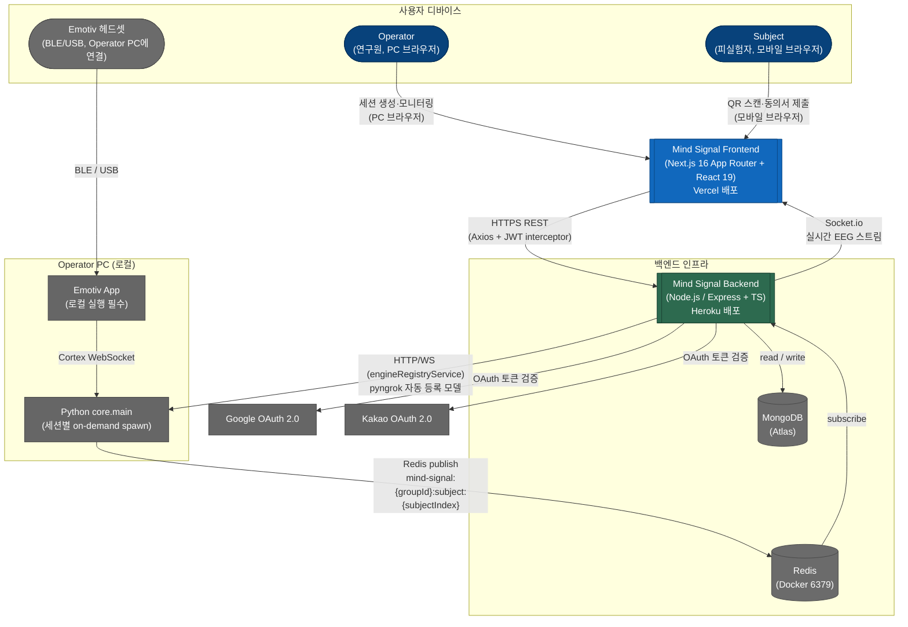

# Architecture Overview — System Context (C4 Level 1, FE perspective)

> **FE 관점의 시스템 컨텍스트 다이어그램.** 누가 시스템을 사용하고,
> 어떤 외부 시스템과 통신하는지를 보여줌. FE(Next.js App Router)가 중심이며,
> BE·Python Engine·인프라와의 통신 경계를 기술함.

## One-line description

Mind Signal은 Emotiv EEG 헤드셋으로 피실험자의 뇌파를 실시간 수집·분석하여
연구자(Operator)에게 라이브 시각화 및 AI 분석 결과를 제공하는 뇌-컴퓨터 인터페이스 연구 플랫폼임.

## System context diagram



## Actors

| Actor | Type | 역할 |
|---|---|---|
| `Operator` | Person | PC 브라우저에서 실험을 관리하는 연구원. QR 생성, EEG 라이브 차트(Recharts) 모니터링, 분석 결과 확인함 |
| `Subject` | Person | 모바일 브라우저로 QR 스캔하여 참여하는 피실험자. EEG 측정 대상임 |

## External systems (FE 관점)

| System | Direction | Purpose |
|---|---|---|
| `Mind Signal Backend` | bidirectional | HTTPS REST(JWT 인증) + Socket.io 실시간 EEG 스트림. FE의 주요 통신 대상 |
| `Google OAuth 2.0` | outbound (via BE) | Operator / Subject 소셜 로그인 — OAuth 토큰 검증은 BE에서 처리됨 |
| `Kakao OAuth 2.0` | outbound (via BE) | 동일 — FE는 리다이렉트 URL 처리만 담당 |
| `Vercel` | — | Next.js App Router 프론트엔드 호스팅 플랫폼 |
| `EMOTIV 헤드셋` | — (Operator 기기에 연결) | FE와 직접 통신 없음. Operator PC에서 Emotiv App → Python Engine → Redis → BE → FE 경로 |

## Key data flows (FE 관점)

| Flow | Description |
|---|---|
| **EEG 실시간 시각화** | BE Socket.io → FE `useSignal` hook → Recharts 바 차트 업데이트 (1초 주기) |
| **세션 생성** | Operator FE `POST /sessions` → BE → QR 코드 응답 → FE 표시 |
| **Subject 페어링** | Subject FE QR 스캔 → `POST /sessions/:pairingToken/pair` → BE 상태 PAIRED → Socket.io 알림 → Operator FE 갱신 |
| **소셜 로그인** | FE 리다이렉트 → Google/Kakao OAuth → BE 토큰 검증 → JWT 발급 → `localStorage['token']` 저장 |
| **Zod 폼 검증** | FE 폼 제출 시 Zod 스키마 클라이언트 검증 → 통과 시 API 호출 |

## FE 특유 아키텍처 포인트

### React Compiler (Forget) 활성화
- Next.js 16 App Router + React 19 + React Compiler 조합 사용 중.
- `useMemo`/`useCallback` 수동 추가 금지 — Compiler가 자동 처리.

### Server Components / Client Components 분리
- 상태·이벤트·브라우저 API를 사용하는 컴포넌트는 `'use client'` 선언 필수.
- SSR 안전 마운트 감지: `useSyncExternalStore` 사용.

### Zod 폼 검증
- 환경변수: `src/07-shared/config/config.ts`에서 Zod로 파싱.
- 폼 입력: 클라이언트 Zod 스키마로 검증 후 API 호출.

### MSW 테스트 모킹
- Vitest + `@vitest/browser` 실브라우저 환경.
- API 모킹: MSW(Mock Service Worker) 사용.
- 141개 테스트 (Playwright browser mode, chromium).

### Playwright E2E
- `e2e/*.spec.ts` — auth, home, join, results 시나리오.
- `playwright.config.ts`의 `webServer`로 `next dev` 자동 기동.

### Socket.io 통신
- BE와 양방향 실시간 통신. `src/05-features/signals/model/use-signal.ts` 경유.
- 세션 상태 폴링: 3초 간격 (WebSocket fallback 아닌 추가 폴링).

## FSD 레이어 구조 (번호 prefix)

```text
app/             ← 01-app: Next.js routes, Providers, root layout
02-processes/    ← (reserved) multi-feature workflows
03-pages/        ← page-level components
04-widgets/      ← Navbar, Footer, SignalChart
05-features/     ← auth, sessions, signals, chat-assistant
06-entities/     ← (reserved) domain entity UI
07-shared/       ← api, config, types, constants, utils
```

import 방향: 번호 높은 레이어 → 번호 낮은 레이어 (`07-shared`가 가장 높은 기반 레이어).
경계 검사: `dependency-cruiser@^17.3.10` — `npm run depcruise` (ADR-003).

## 2PC 확장 경계 (ADR-004, 정보성 참조)

Python Engine 접근은 BE 측 `DATA_ENGINE_URL` env + `engineRegistryService`로 추상화됨.
FE는 BE Socket.io 스트림만 수신하므로 2PC 확장 시 FE 코드 변경 없음.
상세: `mind-signal-backend/docs/architecture/decisions/ADR-004-engine-url-abstraction.md`

## What this diagram is NOT

- C4 Level 2 Container Diagram이 아님 (`containers.md`에서 별도 기술)
- 데이터 흐름도(DFD)가 아님 — 프로세스 간 데이터 이동은 `DFD.md`에서 기술
- 프레임워크 상세(App Router 라우팅, Server Actions)는 Level 2 이하에서 기술함
